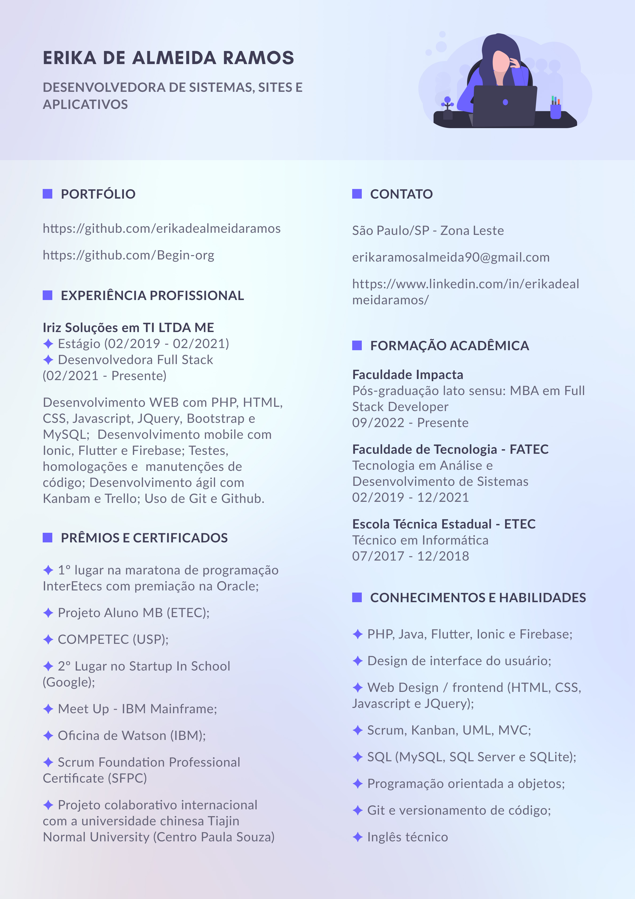

  

  
  
    

 

  

 

  
<b>:bookmark_tabs: &nbsp;Resume</b>

  

  

  
<b>:gear: &nbsp;Git statistics</b>

  

     
         
     
     
    
     
     
    
    
  
 
   
  
  

  
<picture>
  <source media="(prefers-color-scheme: dark)" srcset="https://raw.githubusercontent.com/platane/platane/output/github-contribution-grid-snake-dark.svg">
  <source media="(prefers-color-scheme: light)" srcset="https://raw.githubusercontent.com/platane/platane/output/github-contribution-grid-snake.svg">
  
</picture>

